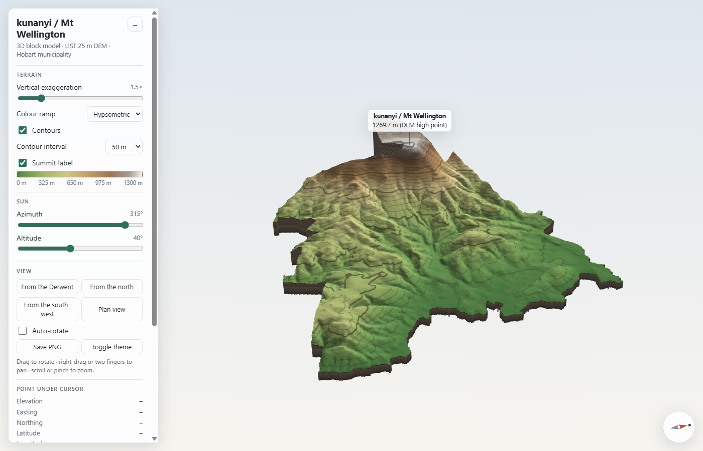

# kunanyi / Mt Wellington – interactive 3D block model

Open **`index.html`** in any modern browser. It is a single self-contained file (1.3 MB) that needs no server or internet connection.



## What it shows

- **Terrain surface.** The full-resolution LIST 25 m DEM: 124,507 cells, drawn as 246,174 triangles. It is lit as a hillshade with an adjustable sun, and coloured by elevation with a choice of four ramps.
- **Block walls and base.** Walls are extruded along every edge of the data footprint, down to a flat base at −250 m. They are shaded as generic strata for readability and are **presentation only, not geology**.
- **Contours.** Drawn in the shader, so they stay sharp at any zoom. The interval can be 20, 50, 100 or 200 m, with every fifth line emphasised.
- **Summit label.** Placed at the DEM high point: **1269.7 m** at MGA55 E519362.5 N5250712.5 (42.89595° S, 147.23715° E). The published summit height is 1271 m; the 25 m cell average sits slightly lower.

## Controls

| Control | Effect |
|---|---|
| Drag / right-drag / scroll | Rotate / pan / zoom (touch: one finger, two fingers, pinch) |
| Vertical exaggeration | 1.0× (true scale) to 4.0×. Default is 1.5× |
| Colour ramp | Hypsometric, earth tones, greyscale or viridis |
| Sun azimuth / altitude | Moves the light source for the hillshade |
| View buttons | From the Derwent (east), from the north, from the south-west, plan view |
| Compass (bottom right) | Shows north. Click it to turn the view to face north |
| Hover or tap | Shows elevation, MGA easting/northing and GDA94 latitude/longitude under the cursor |
| Save PNG | Downloads the current view |

## Data caveats

- The source DEM is **clipped to the Hobart municipality boundary**. The block footprint therefore follows that boundary rather than being a rectangle. The summit sits on the western edge, so the plateau and western slopes beyond the boundary (in Glenorchy and Kingborough) are missing. For a complete mountain, re-extract the DEM from theLIST using a rectangle around the summit and rerun the build.
- CRS: GDA94 / MGA zone 55 (EPSG:28355). Heights are in metres. The supplied metadata does not state a vertical datum.
- Heights are stored in the HTML at 0.1 m precision. Hover values are bilinearly interpolated between cell centres.
- Latitude and longitude are computed in the browser with a Krüger-series inverse transverse Mercator. They were checked against pyproj and agree to better than 1×10⁻⁸°.

## Rebuilding

The build reads `../LIST_DEM_25M_HOBART/list_dem_25m_hobart.asc` and leaves it unchanged. It fills `template.html` with the packed heights and the three.js files in `vendor/`. This machine has no system Python, so run the build through pixi:

```
pixi exec --spec python=3.12 --spec numpy python build_block_model.py
```

To change the look or behaviour, edit `template.html` (base depth, colour ramps, preset views, etc.) and rebuild.

| File | Purpose |
|---|---|
| `index.html` | The deliverable: standalone interactive model |
| `kunanyi_preview.png` | Screenshot of the initial view |
| `build_block_model.py` | Reads the DEM and builds the HTML |
| `template.html` | Viewer source (HTML, CSS, JS and GLSL shaders) |
| `vendor/` | three.js r147 and OrbitControls (MIT licence) |

## Attribution

DEM © State of Tasmania (LIST), supplied under Creative Commons Attribution 3.0 Australia. Extracted 13 January 2021. The original licence, provenance and disclaimer are in `../LIST_DEM_25M_HOBART/readme.txt`.
